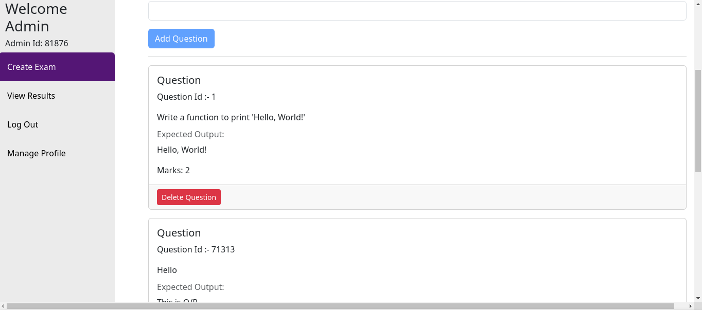

  <h1>🚀 Coding Examination Platform Frontend</h1>
  

    
    
    
  

  
A modern, responsive single-page application built with Angular for conducting coding assessments. This application provides an intuitive interface for users to take coding tests and get real-time feedback on their submissions.

  <h2>✨ Features</h2>

<table align="center">
  <tr>
    <td align="center">🖥️ <b>Interactive Code Editor</b></td>
    <td align="center">⚡ <b>Real-time Compilation</b></td>
    <td align="center">🌐 <b>Multiple Languages</b></td>
  </tr>
  <tr>
    <td align="center">📱 <b>Responsive Design</b></td>
    <td align="center">🧪 <b>Test Case Visualization</b></td>
    <td align="center">📊 <b>User Dashboard</b></td>
  </tr>
</table>

  <h2>🛠️ Tech Stack</h2>

<table align="center">
  <tr>
    <th>Category</th>
    <th>Technologies</th>
  </tr>
  <tr>
    <td>Core Framework</td>
    <td></td>
  </tr>
  <tr>
    <td>Language</td>
    <td></td>
  </tr>
  <tr>
    <td>Styling</td>
    <td>
      
      
    </td>
  </tr>
</table>

  <h2>🔧 Installation</h2>

Click to expand installation steps

<ol>
<li>Clone the repository </li>
<code>git clone https://github.com/yourusername/coding-platform-frontend.git</code> 
<code>cd coding-platform-frontend</code>
<li>Install dependencies </li>
<code>npm install</code>
<li>Start the development server </li>
<code>ng serve</code>
<li>Access the application at<code>http://localhost:4200</code></li>
</ol>

  <h2>📸 Screenshots</h2>

View Application Screenshots

  <h3>Screenshot 1</h3>
  
  <h3>Screenshot 2</h3>
  
  <h3>Screenshot 3</h3>
  
  <h3>Screenshot 4</h3>
  
  <h3>Screenshot 5</h3>
  
  <h3>Screenshot 6</h3>
  
  <h3>Screenshot 7</h3>
  
  <h3>Screenshot 8</h3>
  
  <h3>Screenshot 9</h3>
  
  <h3>Screenshot 10</h3>
  

  <h2>💻 Development Commands</h2>

<table align="center">
  <tr>
    <th>Command</th>
    <th>Description</th>
  </tr>
  <tr>
    <td><code>ng serve</code></td>
    <td>Start development server</td>
  </tr>
  <tr>
    <td><code>ng build</code></td>
    <td>Build the application</td>
  </tr>
  <tr>
    <td><code>ng test</code></td>
    <td>Run unit tests</td>
  </tr>
  <tr>
    <td><code>ng lint</code></td>
    <td>Run linting</td>
  </tr>
</table>

  <h2>🤝 Contributing</h2>

<h2>Fork the repository</h2>

 Create your feature branch <code>(git checkout -b feature/AmazingFeature)</code>
 Commit your changes <code>(git commit -m 'Add some AmazingFeature')</code>
 Push to the branch <code>(git push origin feature/AmazingFeature)</code>
 Open a Pull Request

  <h2>📝 License</h2>
  
This project is licensed under the MIT License - see the <a href="LICENSE.md">LICENSE.md</a> file for details

  <h2>👥 Contact</h2>
  

   <strong> Ankit Borude - ankitborude250@gmail.com</strong>
     
    Project Link: <a href="https://github.com/AnkitBorude/Coding-Exam-App">https://github.com/AnkitBorude/Coding-Exam-App</a>
  

  <h2>🙏 Acknowledgments</h2>
  <ul style="list-style: none;">
    <li><a href="https://angular.io/docs">Angular Documentation</a></li>
    <li><a href="https://getbootstrap.com">Bootstrap</a></li>
    <li>Code Compiler API <a href="https://ce.judge0.com/">Judge0 CE</li>
  </ul>

